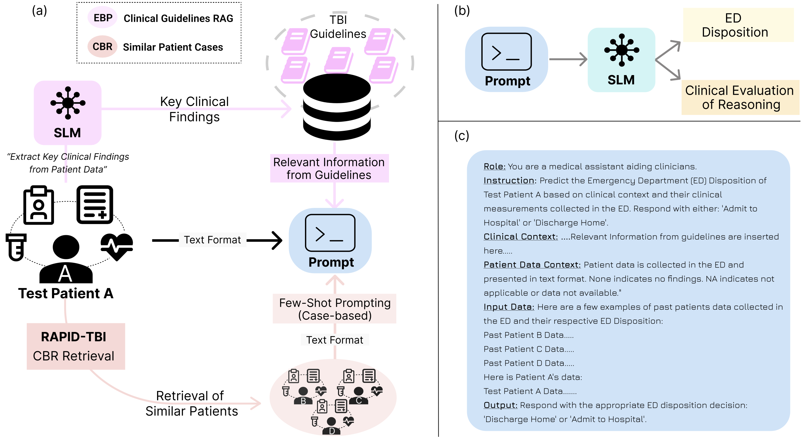

# TBI-Prognosis-with-SLM
This is the official GitHub Repo for the "Personalized Case- and Evidence-Based TBI Prognosis with Small Language Models" presented IEEE Biomedical Health Informatics (BHI) 2025. 

Authors: Pranav Manjunath, Syed M. Adil, Benjamin D. Wissel, Daniel P. Sexton, Brian Lerner, Timothy W. Dunn

Affiliation: Duke University





NOTE: We are unable to provide the patient data (similar patient retrieval) due to PHI concerns but have provided the RAG EBP database.


# LLM Query System

A local LLM serving and querying system that allows you to run experiments with few-shot learning capabilities.

## 📁 Repository Structure

- `serve_llm.py` - LLM server that hosts the model on a specified port
- `query_llm_final.py` - Client script for running experiments and queries
- `prompts.py` - Contains prompt templates and configurations

## 🚀 Quick Start

### Prerequisites

- Python 3.7+
- Hugging Face account and access token
- Required Python packages (install via pip)

### Step 1: Configure Hugging Face Access

1. Get your Hugging Face access token from [https://huggingface.co/settings/tokens](https://huggingface.co/settings/tokens)

2. Open `serve_llm.py` and add your access token:
   ```python
   # Add your Hugging Face access token
   access_token = "your_huggingface_token_here"
   ```

3. If you haven't installed the required model, make sure to include the token as a parameter for the model and tokenizer initialization.

### Step 2: Start the LLM Server

Open a terminal and start the LLM server:

```bash
python serve_llm.py --model <model_name> --port <port_number>
```

**Example:**
```bash
python serve_llm.py --model phi --port 8000
```

Once running, you'll have an LLM server active on the specified port.

### Step 3: Run Experiments

In a **new terminal window**, use the query script to run experiments:

```bash
python query_llm_final.py [arguments]
```

## 🔧 Query Arguments

The `query_llm_final.py` script accepts several arguments:

- `--model`: Specify the model name
- `--port`: Port number where the LLM server is running
- `--few-shot`: Number of few-shot examples
- `--type`: Type of few-shot learning
- Additional parse key arguments available

## 📝 Usage Examples

### Basic Query Example

```bash
python query_llm_final.py --model phi --port 8000 --few-shot 3 --type few
```
# RAG_PartA Folder

This folder contains code that integrates EBP (Evidence-Based Practice) and CBR (Case-Based Reasoning) together to predict ED (Emergency Department) Disposition.

## 🚀 Getting Started

Similar to the main setup, you need to run two files in sequence:

1. **Start the LLM server**: `serve_llm.py`
2. **Run the RAG queries**: `partA_query_llm_final_RAG.py`

## 📋 Usage Instructions

### Step 1: Start the LLM Server

```bash
python serve_llm.py --model <model_name> --port <port_number>
```

### Step 2: Run RAG Experiments

```bash
python partA_query_llm_final_RAG.py [arguments]
```

## 🔧 Arguments for partA_query_llm_final_RAG.py

### RAG Strategy
- `--rag_strategy`: Choose the RAG retrieval strategy
  - **Default**: `sentence-local`
  - **Options**: 
    - `sentence-local`
    - `sentence-global` 
    - `prompt-global`

### Top-K Retrieval
- `--top_k`: Number of top results to retrieve for any RAG strategy
  - Used with `sentence-local`, `sentence-global`, or `prompt-global`

## 📝 Example Usage

```bash
# Using sentence-local strategy with top 5 results
python partA_query_llm_final_RAG.py --rag_strategy sentence-local --top_k 5

# Using sentence-global strategy with top 10 results  
python partA_query_llm_final_RAG.py --rag_strategy sentence-global --top_k 10

# Using prompt-global strategy with top 3 results
python partA_query_llm_final_RAG.py --rag_strategy prompt-global --top_k 3
```

## 🔄 Complete Workflow

1. **Setup**: Ensure your LLM server is configured and running
2. **Execute**: Run the RAG query script with your desired strategy
3. **Analyze**: Review the ED disposition predictions
4. **Iterate**: Experiment with different RAG strategies and top_k values

## 📊 RAG Strategy Descriptions

- **sentence-local**: Retrieves relevant sentences from local knowledge base
- **sentence-global**: Retrieves relevant sentences from global knowledge base  
- **prompt-global**: Uses global prompt-based retrieval approach

---

**Note**: Make sure the LLM server is running before executing the RAG query script.
<!-- 
## 🔄 Complete Workflow

1. **Setup**: Configure your Hugging Face token in `serve_llm.py`
2. **Serve**: Start the LLM server on your desired port
3. **Query**: Run experiments using the query script
4. **Analyze**: Review the results and iterate

## 📋 Terminal Commands Summary

```bash
# Terminal 1: Start the LLM server
python serve_llm.py --model <model_name> --port <port_number>

# Terminal 2: Run queries
python query_llm_final.py --model <model_name> --port <port_number> --few-shot <number> --type <type>
```

## 🛠️ Troubleshooting

- Ensure your Hugging Face token has the necessary permissions
- Verify the model name is correct and accessible
- Check that the specified port is available
- Make sure both terminals are in the same directory

## 📞 Support

For issues or questions, please open an issue in this repository.

---

**Note**: Make sure to keep your Hugging Face access token secure and never commit it to version control. -->
